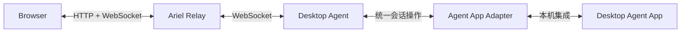

<p align="center">
  
</p>

<h1 align="center">Ariel</h1>

<p align="center">在浏览器中完成与桌面端 Agent App 的远程会话。</p>

## 20 秒了解 Ariel

https://github.com/user-attachments/assets/0f0abfb1-7ee0-4bbe-a6ee-a5a9d36728ee

## Ariel 是什么

Ariel 是一个面向桌面端 Agent App 的浏览器远程会话中继器。离开桌面端后，你仍可以在手机或其他浏览器中查看原会话的历史与实时输出、继续发送消息、停止任务、处理审批与补充问题，也可以管理排队输入或在指定项目中新建会话。

Ariel 不复制会话，不接管工作目录，也不建立另一套聊天记录。桌面端 Agent App 始终是会话和执行状态的唯一来源。

## 架构



- **Web** 提供适配手机和桌面浏览器的会话界面。
- **Relay** 负责浏览器认证、连接管理和消息转发。
- **Desktop Agent** 运行在桌面设备上，维护与 Relay 的主动连接。
- **Agent App Adapter** 把统一会话操作转换为目标 Agent App 的本机能力。

所有运行状态都来自目标 Agent App；Relay 不持久化第二份会话正文，也不会自动重放结果不确定的操作。详细边界见[架构总览](docs/architecture/overview.md)。

## 当前支持范围

| 维度 | 当前实现 |
| --- | --- |
| 桌面平台 | macOS |
| Agent App | Codex Desktop |
| 本机接入 | Codex Desktop 私有 IPC 与内置 Codex App Server |
| 部署方式 | 单用户；可信局域网可用 6 位 PIN，公网可用原生 Passkey；Relay + Web 可用 Docker、ECS 单机脚本或 Kubernetes 交付 |

这是当前实现矩阵，不是 Ariel 的产品边界。其他桌面平台和 Agent App 尚未适配，也不能由现有测试推断为可用。

## 快速开始（当前 Codex Adapter）

准备一台正在运行 Codex Desktop 的 Mac，并安装 Go 1.26+、Node.js 和 npm。手机与 Mac 需要连接同一个可信局域网。

```sh
git clone https://github.com/wu8685/Ariel.git
cd Ariel
./scripts/ariel.sh up local \
  --listen '<HOST-LAN-IP>:8080' \
  --device-id 'my-desktop' \
  --device-name '我的桌面设备'
```

脚本会构建 Web、Relay 和 Desktop Agent，并在成功后输出手机可访问的地址。查看运行状态和六位连接码：

```sh
./scripts/ariel.sh status
./scripts/ariel.sh show-pin
```

## 基本使用

1. 在手机浏览器中打开启动脚本输出的地址。
2. 输入六位连接码，选择已有会话或创建新会话。
3. 浏览器已连接时，可以使用“手机扫码登录”为另一台手机生成一次性登录二维码。
4. 切换 Wi-Fi 或手机热点后，运行 `./scripts/ariel.sh restart-local` 自动发现新的局域网地址并重启。

常用命令：

```sh
./scripts/ariel.sh up             # 使用已保存的配置启动
./scripts/ariel.sh status         # 查看 Relay、Desktop Agent 和 Agent App 状态
./scripts/ariel.sh restart-local  # 换网后发现新地址并重启
./scripts/ariel.sh stop           # 停止 Ariel 管理的本地进程
```

## 安全边界

Ariel 当前采用单用户模型：登录者可操作全部会话，不提供 RBAC。可信局域网可以继续使用默认 6 位 PIN；公网部署必须使用 HTTPS/WSS，并把 Web 认证切换为 Passkey。Passkey 凭据保存在 Relay 的私有 JSON 文件中，会话使用加密 `HttpOnly` Cookie，因此不需要数据库或外部 OIDC。Agent 跨公网连接 Relay 时仍使用独立高熵 token。

远程操作沿用目标 Agent App 的当前权限；页面出现高权限提示时，请先确认你接受该权限范围。当前 Codex Adapter 依赖 Desktop 私有 IPC，版本变化可能造成兼容性问题；不兼容操作会显式失败，不会被当作成功或自动重试。

## 深入阅读

- [当前 Codex Adapter 的安装、配置与故障排查](docs/operations/agent-install.md)
- [用 Docker 部署 Relay + Web](docs/operations/container-deployment.md)
- [在单台 ECS 上一键部署 Relay + Web](docs/operations/ecs-single-node-deployment.md)
- [用 Kubernetes 快速交付 Relay + Web](docs/operations/kubernetes-deployment.md)
- [公网 Passkey 部署与安全边界](docs/operations/public-passkey-deployment.md)
- [系统架构总览与 Adapter 边界](docs/architecture/overview.md)
- [当前 Codex Adapter 的兼容性与实测边界](docs/compatibility/2026-10-03-m0.md)
- [功能规格索引](docs/specs/README.md)
- [MVP 验收记录](docs/testing/2026-10-04-mvp-acceptance-audit.md)
- [项目待办](docs/TODO.md)
