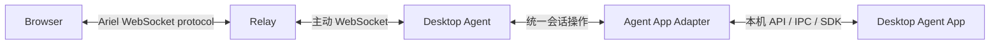

# Ariel 架构总览

Ariel 是浏览器与桌面端 Agent App 之间的远程会话中继器。它让用户从手机或其他浏览器继续桌面端的原会话，同时保留原有执行环境、权限和状态归属。

这一定义不绑定特定桌面操作系统或 Agent App。当前仓库只实现并验证了 macOS 上的 Codex Desktop Adapter；其他组合仍属于后续适配范围。

## 组件

| 组件 | 职责 | 不负责 |
| --- | --- | --- |
| Browser | 展示会话、收集用户的显式操作 | 持有桌面凭据、直接调用 Agent App |
| Relay | 鉴别、连接路由、消息转发和容量限制 | 保存第二份会话正文、代替 Agent App 执行 |
| Desktop Agent | 从桌面设备主动连接 Relay，执行通用请求 | 成为新的会话 SSOT |
| Agent App Adapter | 将通用会话语义映射为具体产品能力 | 把未验证能力伪装成已支持 |
| Agent App | 持有原会话、执行状态、权限和工作环境 | 保存 Ariel 的浏览器连接状态 |

## 不变量

1. 目标 Agent App 是会话与执行状态的唯一事实来源（SSOT）。
2. Relay 和 Desktop Agent 使用有界内存，不建立平行会话数据库或离线写队列。
3. 发送、停止、审批、补充回答和队列修改都必须由用户显式触发。
4. 写操作结果不确定时不自动重放；Ariel 重新读取 Agent App 的权威状态。
5. Web 与 Relay 使用 Ariel 自有协议，不接触某个 Agent App 的私有方法名。

## 认证边界

- Browser → Relay：可信局域网可选择 6 位 PIN；公网使用原生 Passkey 和加密 `HttpOnly` Cookie。两种模式互斥，Passkey 模式不接受 PIN、旧 Web Session 或二维码配对凭据降级。
- Desktop Agent → Relay：始终使用独立高熵 Agent token；跨公网时必须使用 WSS。
- Desktop Agent → 本机 Agent App：由具体 Adapter 使用目标产品的本机集成能力，不复用 Relay 登录。

Passkey 公钥记录保存在小型私有 JSON 文件中，属于认证配置，不是会话数据库。Relay 仍不保存会话正文、离线任务或服务端 Web Session；需要全局注销浏览器时轮换 Cookie key。完整部署边界见[公网 Passkey 部署](../operations/public-passkey-deployment.md)。

## Agent App Adapter 边界

一个 Adapter 可以按目标产品能力提供以下子集：

- 会话列表、搜索、读取与实时订阅；
- 新建会话、发送、停止与运行状态；
- 审批、结构化补充问题和后续输入队列；
- 项目目录、置顶状态、附件和工具活动；
- 版本检测、能力声明与明确的兼容错误。

能力必须在握手时声明。Web 只展示当前 Adapter 明确支持的操作；缺失或未验证的能力保持不可用，不能从另一个 Adapter 的行为类推。

## 当前支持矩阵

| 桌面平台 | Agent App | Adapter 状态 | 证据 |
| --- | --- | --- | --- |
| macOS | Codex Desktop | 已实现；按最低版本门禁，较高版本运行期验证 | [兼容性报告](../compatibility/2026-10-03-m0.md) |
| Windows / Linux | 尚无 | 未适配 | 无 |
| 其他 Agent App | 尚无 | 未适配 | 无 |

这张表描述当前发行版，不是 Ariel 的产品边界。未列为“已实现”的组合均不可视为受支持。

## 现有耦合与演进方向

provider-neutral 的分层目标已经明确，但通用 Adapter 抽象尚未完成。当前代码仍包含 `internal/codex`、协议字段 `codexReady`、Codex deep link、版本探针和产品特定交互映射。

接入第二个 Agent App 或桌面平台前，需要先：

1. 提取稳定的 Adapter 接口和能力一致性测试；
2. 将产品特定就绪状态迁移为通用能力，同时保持 v1 协议兼容；
3. 把启动、版本检测和本机发现移动到各 Adapter；
4. 为新组合单独定义权限、失败语义、兼容矩阵和隔离 fixture；
5. 完成对应平台的真实浏览器与桌面端验收。

早期 Codex 专用决策与实验保留在 [`docs/specs/baseline/`](../specs/baseline/README.md)，作为首个 Adapter 的历史证据，不再承担 Ariel 的长期产品定义。
